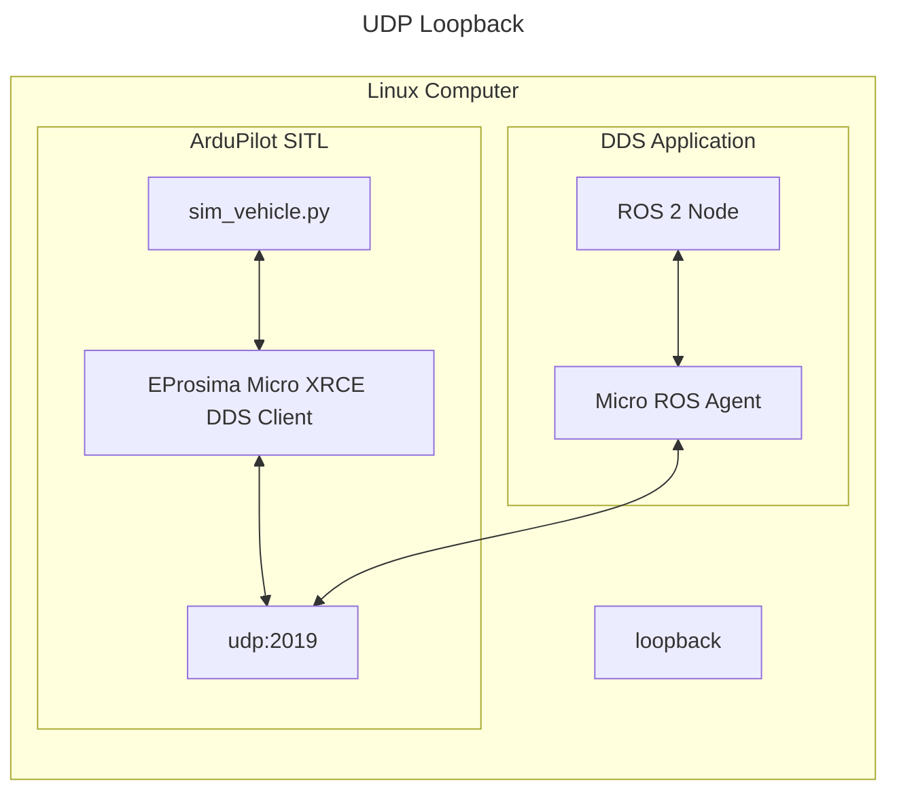
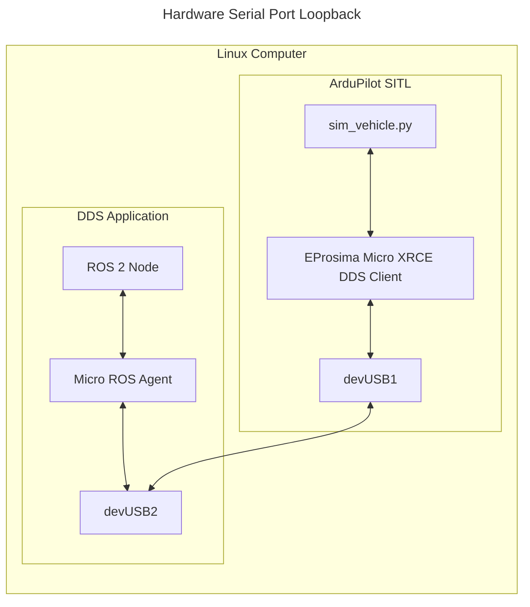

# Testing with DDS/micro-Ros

## Architecture

ArduPilot contains the DDS Client library, which can run as SITL. Then, the DDS application runs a ROS 2 node, an eProsima Integration Service, and the MicroXRCE Agent. The two systems communicate over serial or UDP.





## MAVLink-over-DDS Mirroring Mode (`DDS_MAV_MODE`)

This fork adds an additional, simpler mode alongside the standard ROS 2 topic-based DDS
interface described above: instead of translating individual vehicle values into their own
typed ROS 2 topics, it mirrors the **raw MAVLink byte stream** (exactly what you'd see on a
normal MAVLink connection) over two DDS topics. This is useful when you just want a DDS/DDS-Router
based transport between a vehicle and a ground station, without implementing a per-message
ROS 2 topic mapping on the receiving side.

### Enabling it

No special build flag is needed -- this ships as part of the same `AP_DDS` library documented
above. Build and run SITL with DDS enabled as usual:

```bash
./waf configure --board sitl --enable-DDS
./waf copter
```

Then set the following parameters (e.g. via a `.parm` defaults file passed to
`--defaults`, or from a GCS parameter editor):

| Parameter | Meaning | Typical value |
|---|---|---|
| `DDS_MAV_MODE` | `1` enables raw MAVLink-over-DDS mirroring, `0` (default) leaves the vehicle on the standard ROS 2 topic interface only | `1` |
| `DDS_DOMAIN_ID` | DDS domain ID this vehicle participates in | project-specific |
| `DDS_UDP_PORT` | UDP port used to reach the Micro XRCE-DDS Agent | `8888` |

### Wire topics

| Topic | Direction | Type |
|---|---|---|
| `/vehicle_data/from_dds` | Vehicle -> ground (outgoing MAVLink bytes) | `filemsg_msgs::msg::dds_::filemsg_` |
| `/vehicle_data/to_dds` | Ground -> vehicle (incoming MAVLink bytes) | `filemsg_msgs::msg::dds_::filemsg_` |
| `/vehicle_data/log_request` | Ground -> vehicle, `LOG_REQUEST_*` commands only (dropped while armed) | `filemsg_msgs::msg::dds_::filemsg_` |
| `/vehicle_data/log_data` | Vehicle -> ground, `LOG_DATA`/`LOG_ENTRY` responses only (`AP_DDS_LOG_DATA_PUB_ENABLED`) | `filemsg_msgs::msg::dds_::filemsg_` |

Each `filemsg` sample carries one raw MAVLink frame's worth of bytes (`data`, `length`, plus
`offset`/`step`/`eof` framing fields for any future multi-part use) -- a DDS subscriber that
just re-emits `data` byte-for-byte over a plain UDP socket is enough to bridge this to any
regular MAVLink-speaking ground station (Mission Planner, QGroundControl, etc.) with no further
parsing required on the DDS side.

`/vehicle_data/log_data` exists so a `.bin` dataflash log download (sent in reply to
`/vehicle_data/log_request`) never mixes into `/vehicle_data/from_dds` -- `publish_vehicle_data()`
peeks the reassembled frame's `msgid` and routes `LOG_DATA`/`LOG_ENTRY` onto this separate topic
instead. That way whichever ground-side participant actually subscribes to it (e.g. MngData) is
the only one that receives `.bin` payload bytes; participants that only subscribe to `from_dds`
(a GCS bridge, a digital-twin visualizer, etc.) never see them on the wire.

### `DDS_MAV_MODE` vs. MAVROS

| Axis | MAVROS | `DDS_MAV_MODE` |
|---|---|---|
| Message coverage | Only messages MAVROS has mapped (hundreds, but finite) | Every MAVLink message on the channel is included automatically; no code change needed for new message types |
| Schema / type safety | Type-safe via DDS IDL | DDS just moves bytes -- all parsing responsibility shifts to the consumer (GCS, etc.) |
| ROS 2 dependency | Requires a full ROS 2 stack (companion computer) | No ROS 2 needed anywhere from FC→Agent→DDS-Router→subscriber |
| Domain bridging | Out of scope (assumes same domain) | DDS-Router treats domain 10 (vehicle) / domain 0 (ground) separation as a first-class concern |
| FC-side overhead | None (a separate process on the companion computer handles it) | Very light -- just memcpy's the bytes it was already sending into a queue |
| Where maintenance lives | Depends on upstream MAVROS mappings (centralized, well-tested) | Owned by the project itself -- bears its own risk, e.g. the framing bug found and fixed here |
| Security | A plain MAVLink link is usually unprotected | Can directly reuse AP_DDS's DTLS/mutual-TLS |

MAVROS is the better fit when you're already committed to living inside the ROS 2 ecosystem --
it plugs straight into rviz, nav2, MoveIt, etc. But the actual consumers of this mode (Mission
Planner-style GCS, custom viewers) are existing desktop apps with their own MAVLink parsers
already, not ROS nodes. Rather than turning those apps into ROS nodes or upstreaming support
for messages MAVROS hasn't mapped, it's more efficient to tunnel the raw MAVLink bytes over DDS
and reuse each app's existing parser.

### `DDS_MAV_MODE` vs. MAVROS (한국어)

| 축 | MAVROS | `DDS_MAV_MODE` |
|---|---|---|
| 메시지 커버리지 | MAVROS가 매핑해둔 메시지만 (수백 개지만 유한) | 채널에 실리는 모든 MAVLink 메시지 자동 포함, 신규 메시지 추가 시 코드 변경 불필요 |
| 스키마/타입세이프티 | DDS 레벨에서 IDL로 타입 보장 | DDS는 바이트만 옮김 -- 파싱 책임이 전부 컨슈머(GCS 등)로 이전 |
| ROS2 의존성 | 풀 ROS2 스택 필수 (컴패니언 컴퓨터) | FC→Agent→DDS-Router→구독자 전 구간 ROS2 불필요 |
| 도메인 브리징 | 관심사 밖 (동일 도메인 가정) | DDS-Router가 도메인10(드론)/도메인0(관제) 분리를 1급 시민으로 처리 |
| FC 측 오버헤드 | 없음(별도 프로세스가 companion에서 처리) | 매우 가벼움 -- 기존에 나가던 바이트를 memcpy해서 큐에 넣을 뿐 |
| 유지보수 소재지 | 업스트림 MAVROS 매핑에 의존 (중앙집중, 검증됨) | 프로젝트가 직접 소유 -- 프레이밍 버그 같은 리스크를 자체 부담 |
| 보안 | 표준 MAVLink 링크는 보통 무보호 | AP_DDS의 DTLS/mutual-TLS를 그대로 재사용 가능 |

MAVROS는 "이미 ROS2 생태계 안에서 살 것"이 전제일 때 유리하다 -- rviz, nav2, MoveIt 등과
바로 붙는다. 하지만 이 모드를 쓰는 실제 소비자들(Mission Planner류 GCS, 커스텀 뷰어)은
전부 이미 MAVLink 파서를 가진 기존 데스크톱 앱이지 ROS 노드가 아니다. 그 앱들을 ROS
노드로 새로 만들거나 MAVROS 매핑에 없는 메시지를 위해 업스트림에 기여하는 것보다, 원본
MAVLink를 그대로 DDS로 실어 나르고 각 앱의 기존 파서를 재사용하는 쪽이 개발량 대비
합리적이다.

## Installation

While DDS support in ArduPilot is mostly through git submodules,
you must install Micro XRCE DDS Gen and create a workspace.

Follow the wiki [here](https://ardupilot.org/dev/docs/ros2.html)
to set up your environment.

### Serial Only: Set up serial for SITL with DDS

On Linux, creating a virtual serial port will be necessary to use serial in SITL, because of that install socat.

```bash
sudo apt-get update
sudo apt-get install socat
```

## Setup ardupilot for SITL with DDS

Set up your [SITL](https://ardupilot.org/dev/docs/setting-up-sitl-on-linux.html).
Run the simulator with the following command. If using UDP, the only parameter you need to set it `DDS_ENABLE`.

| Name | Description | Default |
| - | - | - |
| DDS_ENABLE | Set to 1 to enable DDS, or 0 to disable | 1 |
| DDS_USE_NS | Set to 1 to include `v<MAV_SYSID>` in topic/service names | 0 |
| SERIAL1_BAUD | The serial baud rate for DDS | 57 |
| SERIAL1_PROTOCOL | Set this to 45 to use DDS on the serial port | 0 |

```console
# Wipe params till you see "AP: ArduPilot Ready"
# Select your favorite vehicle type
sim_vehicle.py -w -v ArduPlane --console -DG --enable-DDS

# Only set this for Serial, which means 115200 baud
param set SERIAL1_BAUD 115
# See libraries/AP_SerialManager/AP_SerialManager.h AP_SerialManager SerialProtocol_DDS_XRCE
param set SERIAL1_PROTOCOL 45
```

DDS is currently enabled by default, if it's part of the build. To disable it, run the following and reboot the simulator.

```text
param set DDS_ENABLE 0
REBOOT
```

## Using the ROS 2 CLI to Read ArduPilot Data

After your setup is complete, do the following:

- Source the ROS 2 installation

  ```console
  source install/setup.bash
  ```

Next, follow the associated section for your chosen transport, and finally you can use the ROS 2 CLI.

### UDP (recommended for SITL)

- Run the microROS agent

  ```console
  cd ardupilot/libraries/AP_DDS
  ros2 run micro_ros_agent micro_ros_agent udp4 -p 2019
  ```

- Run SITL (remember to kill any terminals running ardupilot SITL beforehand)

  ```console
  sim_vehicle.py -v ArduPlane -DG --console --enable-DDS
  ```

### Serial

- Start a virtual serial port with socat. Take note of the two `/dev/pts/*` ports. If yours are different, substitute as needed.

  ```console
  socat -d -d pty,raw,echo=0 pty,raw,echo=0
  >>> 2023/02/21 05:26:06 socat[334] N PTY is /dev/pts/1
  >>> 2023/02/21 05:26:06 socat[334] N PTY is /dev/pts/2
  >>> 2023/02/21 05:26:06 socat[334] N starting data transfer loop with FDs [5,5] and [7,7]
  ```

- Run the microROS agent

  ```console
  cd ardupilot/libraries/AP_DDS
  # assuming we are using tty/pts/2 for DDS Application
  ros2 run micro_ros_agent micro_ros_agent serial -b 115200 -D /dev/pts/2
  ```

- Run SITL (remember to kill any terminals running ardupilot SITL beforehand)

  ```console
  # assuming we are using /dev/pts/1 for ArduPilot SITL
  sim_vehicle.py -v ArduPlane -DG --console --enable-DDS -A "--serial1=uart:/dev/pts/1"
  ```

## Use ROS 2 CLI

You should be able to see the agent here and view the data output.

```bash
$ ros2 node list
/ardupilot_dds
```

Depending on what's configured, you will see something similar to this:

```bash
$ ros2 topic list -v
Published topics:
 * /ap/airspeed [ardupilot_msgs/msg/Airspeed] 1 publisher
 * /ap/battery [sensor_msgs/msg/BatteryState] 1 publisher
 * /ap/clock [rosgraph_msgs/msg/Clock] 1 publisher
 * /ap/geopose/filtered [geographic_msgs/msg/GeoPoseStamped] 1 publisher
 * /ap/gps_global_origin/filtered [geographic_msgs/msg/GeoPointStamped] 1 publisher
 * /ap/imu/experimental/data [sensor_msgs/msg/Imu] 1 publisher
 * /ap/navsat [sensor_msgs/msg/NavSatFix] 1 publisher
 * /ap/pose/filtered [geometry_msgs/msg/PoseStamped] 1 publisher
 * /ap/rc [ardupilot_msgs/msg/Rc] 1 publisher
 * /ap/status [ardupilot_msgs/msg/Status] 1 publisher
 * /ap/tf_static [tf2_msgs/msg/TFMessage] 1 publisher
 * /ap/time [builtin_interfaces/msg/Time] 1 publisher
 * /ap/twist/filtered [geometry_msgs/msg/TwistStamped] 1 publisher
 * /parameter_events [rcl_interfaces/msg/ParameterEvent] 1 publisher
 * /rosout [rcl_interfaces/msg/Log] 1 publisher

Subscribed topics:
 * /ap/cmd_gps_pose [ardupilot_msgs/msg/GlobalPosition] 1 subscriber
 * /ap/cmd_vel [geometry_msgs/msg/TwistStamped] 1 subscriber
 * /ap/joy [sensor_msgs/msg/Joy] 1 subscriber
 * /ap/tf [tf2_msgs/msg/TFMessage] 1 subscriber
 * /clock [rosgraph_msgs/msg/Clock] 1 subscriber
```

For a full list of interfaces, see [here](https://ardupilot.org/dev/docs/ros2-interfaces.html).

```bash
$ ros2 topic hz /ap/time
average rate: 50.115
        min: 0.012s max: 0.024s std dev: 0.00328s window: 52
```

```bash
$ ros2 topic echo /ap/time
sec: 1678668735
nanosec: 729410000
```

```bash
$ ros2 service list
/ap/arm_motors
/ap/mode_switch
/ap/prearm_check
/ap/experimental/takeoff
---
```

The static transforms for enabled sensors are also published, and can be received like so:

```bash
ros2 topic echo /ap/tf_static --qos-depth 1 --qos-history keep_last --qos-reliability reliable --qos-durability transient_local --once
```

In order to consume the transforms, it's highly recommended to [create and run a transform broadcaster in ROS 2](https://docs.ros.org/en/humble/Concepts/About-Tf2.html#tutorials).

## Using ROS 2 services

The `AP_DDS` library exposes services which are automatically mapped to ROS 2
services using appropriate naming conventions for topics and message and service
types. An earlier version of `AP_DDS` required the use of the eProsima
[Integration Service](https://github.com/eProsima/Integration-Service) to map
the request / reply topics from DDS to ROS 2, but this is no longer required.

List the available services:

```bash
$ ros2 service list -t
/ap/arm_motors [ardupilot_msgs/srv/ArmMotors]
/ap/mode_switch [ardupilot_msgs/srv/ModeSwitch]
/ap/prearm_check [std_srvs/srv/Trigger]
/ap/experimental/takeoff [ardupilot_msgs/srv/Takeoff]
```

Call the arm motors service:

```bash
$ ros2 service call /ap/arm_motors ardupilot_msgs/srv/ArmMotors "{arm: True}"
requester: making request: ardupilot_msgs.srv.ArmMotors_Request(arm=True)

response:
ardupilot_msgs.srv.ArmMotors_Response(result=True)
```

Call the mode switch service:

```bash
$ ros2 service call /ap/mode_switch ardupilot_msgs/srv/ModeSwitch "{mode: 4}"
requester: making request: ardupilot_msgs.srv.ModeSwitch_Request(mode=4)

response:
ardupilot_msgs.srv.ModeSwitch_Response(status=True, curr_mode=4)
```

Call the prearm check service:

```bash
$ ros2 service call /ap/prearm_check std_srvs/srv/Trigger
requester: making request: std_srvs.srv.Trigger_Request()

response:
std_srvs.srv.Trigger_Response(success=False, message='Vehicle is Not Armable')

or

std_srvs.srv.Trigger_Response(success=True, message='Vehicle is Armable')
```

Call the takeoff service:

```bash
$ ros2 service call /ap/experimental/takeoff ardupilot_msgs/srv/Takeoff "{alt: 10.5}"
requester: making request: ardupilot_msgs.srv.Takeoff_Request(alt=10.5)

response:
ardupilot_msgs.srv.Takeoff_Response(status=True)
```

## Commanding using ROS 2 Topics

The following topic can be used to control the vehicle.

- `/ap/joy` (type `sensor_msgs/msg/Joy`): overrides a maximum of 8 RC channels,

at least 4 axes must be sent. Values are clamped between -1.0 and 1.0.
Use `NaN` to disable the override of a single channel.
A channel defaults back to RC after 1 second of not receiving commands.

```bash
ros2 topic pub /ap/joy sensor_msgs/msg/Joy "{axes: [0.0, 0.0, 0.0, 0.0]}"

publisher: beginning loop
publishing #1: sensor_msgs.msg.Joy(header=std_msgs.msg.Header(stamp=builtin_interfaces.msg.Time(sec=0, nanosec=0), frame_id=''), axes=[0.0, 0.0, 0.0, 0.0], buttons=[])
```

- `/ap/cmd_gps_pose` (type `ardupilot_msgs/msg/GlobalPosition`): sends

a waypoint to head to when the selected mode is GUIDED.

```bash
ros2 topic pub /ap/cmd_gps_pose ardupilot_msgs/msg/GlobalPosition "{latitude: 34, longitude: 118, altitude: 1000}"

publisher: beginning loop
publishing #1: ardupilot_msgs.msg.GlobalPosition(header=std_msgs.msg.Header(stamp=builtin_interfaces.msg.Time(sec=0, nanosec=0), frame_id=''), coordinate_frame=0, type_mask=0, latitude=34.0, longitude=118.0, altitude=1000.0, velocity=geometry_msgs.msg.Twist(linear=geometry_msgs.msg.Vector3(x=0.0, y=0.0, z=0.0), angular=geometry_msgs.msg.Vector3(x=0.0, y=0.0, z=0.0)), acceleration_or_force=geometry_msgs.msg.Twist(linear=geometry_msgs.msg.Vector3(x=0.0, y=0.0, z=0.0), angular=geometry_msgs.msg.Vector3(x=0.0, y=0.0, z=0.0)), yaw=0.0)
```

## Clock Synchronisation

When running in a simulated environment, The master simulation clock (usually ``/clock``) needs to be provided to Ardupilot to ensure ArduPilot's topics
have the correct timestamp. This ensure that any sensor fusion (or similar) nodes in ROS 2 fuse the correct data.

ArduPilot SITL uses the standard ROS2 parameter of ``--use-sim-time <true|false>``. If ``true`` ArduPilot will automatically attempt
to subscribe to ``/clock`` topic and use this for the timestamping of DDS topics. If this is unsuccessful, ArduPilot
will use it's own internal clock.

In either case, ArduPilot will publish the clock to ``/ap/clock`` (or ``/ap/vN/clock`` if namespacing is used).

## Contributing to `AP_DDS` library

### Adding DDS messages to ArduPilot

Unlike the use of ROS 2 `.msg` files, since ArduPilot supports native DDS, the message files follow [OMG IDL DDS v4.2](https://www.omg.org/spec/IDL/4.2/PDF).
This package is intended to work with any `.idl` file complying with those extensions.

Over time, these restrictions will ideally go away.

To get a new IDL file from ROS 2, follow this process:

```bash
cd ardupilot
source /opt/ros/humble/setup.bash

# Find the IDL file
find /opt/ros/$ROS_DISTRO -type f -wholename \*builtin_interfaces/msg/Time.idl

# Create the directory in the source tree if it doesn't exist similar to the one found in the ros directory
mkdir -p libraries/AP_DDS/Idl/builtin_interfaces/msg/

# Copy the IDL
cp /opt/ros/humble/share/builtin_interfaces/msg/Time.idl libraries/AP_DDS/Idl/builtin_interfaces/msg/

# Build the code again with the `--enable-DDS` flag as described above
```

If the message is custom for ardupilot, first create the ROS message in `Tools/ros2/ardupilot_msgs/msg/GlobalPosition.msg`.
Then, build ardupilot_msgs with colcon.
Finally, copy the IDL folder from the install directory into the source tree.

### Rules for adding topics and services

Topics and services available from `AP_DDS` are automatically mapped into ROS 2
provided a few rules are followed when defining the entries in the
topic and service tables.

#### ROS 2 message and service interface types

ROS 2 message and interface definitions are mangled by the `rosidl_adapter` when
mapping from ROS 2 to DDS to avoid naming conflicts in the C/C++ libraries.
The ROS 2 object `namespace::Struct` is mangled to `namespace::dds_::Struct_`
for DDS. The table below provides some example mappings:

| ROS 2 | DDS |
| --- | --- |
| `rosgraph_msgs::msg::Clock` | `rosgraph_msgs::msg::dds_::Clock_` |
| `sensor_msgs::msg::NavSatFix` | `sensor_msgs::msg::dds_::NavSatFix_` |
| `ardupilot_msgs::srv::ArmMotors_Request` | `ardupilot_msgs::srv::dds_::ArmMotors_Request_` |
| `ardupilot_msgs::srv::ArmMotors_Response` | `ardupilot_msgs::srv::dds_::ArmMotors_Response_` |

Note that a service interface always requires a Request / Response pair.

#### ROS 2 topic and service names

The ROS 2 design article: [Topic and Service name mapping to DDS](https://design.ros2.org/articles/topic_and_service_names.html) describes the mapping of ROS 2 topic and service
names to DDS. Each ROS 2 subsystem is provided a prefix when mapped to DDS.
The request / response pair for services require an additional suffix.

| ROS 2 subsystem | DDS Prefix | DDS Suffix |
| --- | --- | --- |
| topics | rt/ | |
| service request | rq/ | Request |
| service response | rr/ | Reply |
| service | rs/ | |
| parameter | rp/ | |
| action | ra/ | |

The table below provides example mappings for topics and services

| ROS 2 | DDS |
| --- | --- |
| ap/clock | rt/ap/clock |
| ap/navsat | rt/ap/navsat |
| ap/arm_motors | rq/ap/arm_motorsRequest, rr/ap/arm_motorsReply |

Refer to existing mappings in [`AP_DDS_Topic_Table`](https://github.com/ArduPilot/ardupilot/blob/master/libraries/AP_DDS/AP_DDS_Topic_Table.h)
and [`AP_DDS_Service_Table`](https://github.com/ArduPilot/ardupilot/blob/master/libraries/AP_DDS/AP_DDS_Service_Table.h)
for additional details.

### Development Requirements

Astyle is used to format the C++ code in AP_DDS. This is required for CI to pass the build.
To run the automated formatter, run:

```bash
./Tools/scripts/run_astyle.py
```

Pre-commit is used for other things like formatting python and XML code.
This will run the tools automatically when you commit. If there are changes, just add them back your staging index and commit again.

1. Install [pre-commit](https://pre-commit.com/#installation) python package.
1. Install ArduPilot's hooks in the root of the repo, then commit like normal

  ```bash
  cd ardupilot
  pre-commit install
  git commit
  ```

## Testing DDS on Hardware

### With Serial

The easiest way to test DDS is to make use of some boards providing two serial interfaces over USB such as the Pixhawk 6X.
The [Pixhawk6X/hwdef.dat](../AP_HAL_ChibiOS/hwdef/Pixhawk6X/hwdef.dat) file has this info.

```text
SERIAL_ORDER OTG1 UART7 UART5 USART1 UART8 USART2 UART4 USART3 OTG2
```

For example, build, flash, and set up OTG2 for DDS

```bash
./waf configure --board Pixhawk6X --enable-DDS
./waf plane --upload
mavproxy.py --console
param set DDS_ENABLE 1
# Check the hwdef file for which port is OTG2
param set SERIAL8_PROTOCOL 45
param set SERIAL8_BAUD 115
reboot
```

Then run the Micro ROS agent

```bash
cd /path/to/ros2_ws
source install/setup.bash
cd src/ardupilot/libraries/AP_DDS
ros2 run micro_ros_agent micro_ros_agent serial -b 115200 -D /dev/serial/by-id/usb-ArduPilot_Pixhawk6X_210028000151323131373139-if02
```

If connection fails, instead of running the Micro ROS agent, debug the stream

```bash
python3 -m serial.tools.miniterm /dev/serial/by-id/usb-ArduPilot_Pixhawk6X_210028000151323131373139-if02  115200 --echo --encoding hexlify
```

The same steps can be done for physical serial ports once the above works to isolate software and hardware issues.
